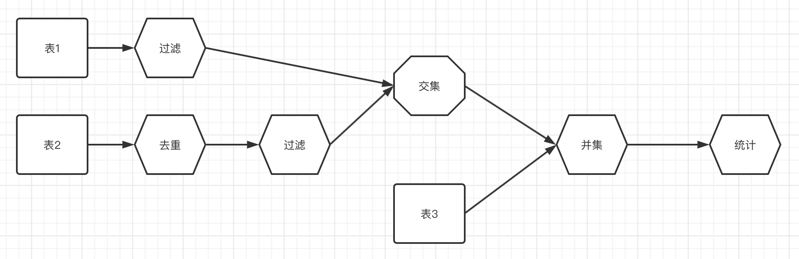

## 表可选字段说明
```json5
{
  "type": "TABLE",
  "name": "t_person1",
  "dialect": "MYSQL",  //当有方言区别时需要设置，比如mysql分页时limit，oracle是rownum
  "schema": "test_srv", //当sql执行当表不在当前db时需要设置
  "fields": [
    "id",
    "name",
    "age"
  ]
}
```
## 综合示例


## 统计示例
```json5
{
  "debug": false,
  "name": "统计",
  "details": {
    "type": "COUNT",
    "group_by_fields": [
      "age"
    ],
    "alias": "c0",
    "source": {
      "type": "TABLE",
      "name": "t_person1",
      "schema": "test_srv",
      "fields": [
        "id",
        "name",
        "age"
      ]
    }
  }
}

```
```sql
SELECT t0.age,count(1) FROM t_person1 t0 GROUP BY t0.age

```

## 去重示例
```json5
{
  "debug": false,
  "name": "去重",
  "details": {
    "type":"DISTINCT",
    "distinct_fields": ["age"],
    "source": {
      "type": "TABLE",
      "name": "t_person1",
      "fields": ["id","name","age"]
    },
    "alias": "d0"
  }
}
```

```sql
SELECT DISTINCT t0.age FROM t_person1 t0
```

## 过滤示例
```json5
{
  "debug": false,
  "name": "过滤",
  "details": {
    "type": "FILTER",
    "select_fields": [
      "id",
      "name",
      "age"
    ],
    "chain": {
      "conditions": [
        {
          "type": "GT",
          "name": "age",
          "value": 10
        }
      ]
    },
    "source": {
      "type": "TABLE",
      "name": "t_person2",
      "fields": [
        "id",
        "name",
        "age"
      ]
    },
    "alias": "f0"
  }
}
```

```sql
SELECT t0.id,t0.name,t0.age FROM t_person2 t0 WHERE (t0.age > 10)

SELECT _l0.id,_l0.name,_l0.age FROM (SELECT t0.name,t0.id,t0.age FROM t_person2 t0 LIMIT 0, 10) AS _l0 WHERE (_l0.age > 10)

```

## 合并列值
```json5
{
  "debug": false,
  "name": "合并列值",
  "details": {
    "type": "GROUP_CONCAT",
    "group_by_fields": [
      "age"
    ],
    "group_concat_fields": [
      "name"
    ],
    "alias": "g0",
    "source": {
      "type": "TABLE",
      "name": "t_person1",
      "fields": [
        "id",
        "name",
        "age"
      ]
    }
  }
}
```

```sql
SELECT t0.age,group_concat(t0.name) FROM t_person1 t0 GROUP BY t0.age
```

## 关联示例
```json5
{
  "debug": false,
  "name": "关联",
  "details": {
    "type": "LEFT_JOIN",
    "join_fields": {
      "left": [
        "id",
        "name"
      ],
      "right": [
        "age"
      ]
    },
    "on": [
      {
        "left": "name",
        "right": "name"
      }
    ],
    "left": {
      "type": "FILTER",
      "select_fields": [
        "id",
        "name",
        "age"
      ],
      "source": {
        "type": "TABLE",
        "name": "t_person2",
        "fields": [
          "id",
          "name",
          "age"
        ]
      },
      "chain": {
        "conditions": [
          {
            "type": "GT",
            "name": "age",
            "value": 5
          }
        ]
      },
      "alias": "v2"
    },
    "right": {
      "type": "FILTER",
      "select_fields": [
        "id",
        "name",
        "age"
      ],
      "source": {
        "type": "TABLE",
        "name": "t_person1",
        "fields": [
          "id",
          "name",
          "age"
        ]
      },
      "chain": {
        "conditions": [
          {
            "type": "GT",
            "name": "age",
            "value": 10
          }
        ]
      },
      "alias": "v1"
    },
    "alias": "v3"
  }
}
```
```sql
    SELECT 
           v2.id,v2.name,v1.age 
    FROM (SELECT 
                 t0.id,t0.name,t0.age 
          FROM t_person2 t0 
          WHERE (t0.age > 5)) AS v2 
    LEFT OUTER JOIN (SELECT 
                            t1.id,t1.name,t1.age 
                   FROM t_person1 t1 
                   WHERE (t1.age > 10)) AS v1 
    ON (v2.name = v1.name)


    SELECT 
           v2.id,v2.name,v1.age 
    FROM (SELECT 
               _l0.id,_l0.name,_l0.age 
          FROM (SELECT 
                     t0.name,t0.id,t0.age 
                FROM t_person2 t0 LIMIT 0, 10) AS _l0 
                WHERE (_l0.age > 5)) AS v2 
    LEFT OUTER JOIN (SELECT 
                            t1.id,t1.name,t1.age 
                     FROM t_person1 t1 
                     WHERE (t1.age > 10)) AS v1 
    ON (v2.name = v1.name)
```
## 差集示例
```json5
{
  "debug": false,
  "name": "差集",
  "details": {
    "type": "DIFF",
    "union_fields": {
      "left": ["id","name","age"],
      "right": ["id","name","age"]
    },
    "on": [
      {
        "left": "id",
        "right": "id"
      }
    ],
    "left": {
      "type": "TABLE",
      "name": "t_person1",
      "fields": ["id","name","age"]
    },
    "right": {
      "type": "TABLE",
      "name": "t_person2",
      "fields": ["id","name","age"]
    },
    "alias": "e0"
  }
}
```
```sql
SELECT _u0.id, _u0.NAME, _u0.age
FROM (
    SELECT t0.id, t0.NAME, t0.age
    FROM t_person1 t0
    UNION
    SELECT t1.id, t1.NAME, t1.age
    FROM t_person2 t1
    ) _u0
WHERE NOT EXISTS (
    SELECT _j0.id, _j0.NAME, _j0.age
    FROM (
    SELECT t2.id, t2.NAME, t2.age
    FROM t_person1 t2
    INNER JOIN t_person2 t3 ON t2.id = t3.id
    ) _j0
    WHERE _j0.id = _u0.id
    )
```

## 分页
```json5
{
  "debug": false,
  "name": "分页",
  "details": {
    "type": "PAGE",
    "dialect": "MYSQL",
    "offset": 20,
    "limit": 10,
    "alias": "p0",
    "source": {
      "type": "TABLE",
      "name": "t_person1",
      "schema": "test_srv",
      "fields": [
        "id",
        "name",
        "age"
      ]
    },
    "order_fields": [
      {
        "name": "id",
        "type": "ASC"
      }
    ]
  }
}
```

```sql
SELECT t0.name,t0.id,t0.age FROM t_person1 t0 ORDER BY t0.id DESC LIMIT 20, 10
```
## 测试
```sql
环境
mysql8
mongo 5.0.1

测试机 macos m1 16g
```
```text
# 30w
查询花费时间 :0s
time = 4s


# 300w
查询花费时间 :18s
time = 45s
```


